# Architecture Diagrams

This document describes the current architecture of `mida-processor` based on the implementation in `src/`.

The service is a long-running Python worker that:

- loads region- and environment-specific configuration at startup
- polls Manhattan Active for eligible open orders
- retrieves facilities, customers, rules, scenarios, and SLA settings from MIDA MSSQL
- evaluates dynamic business rules with `asteval`
- builds update payloads for Manhattan
- updates and releases orders in batches
- writes operational outcomes to legacy MSSQL logs
- pushes successful updates to Redis so downstream components can continue the flow

## 1. Architecture Summary

At a high level, `mida-processor` is organized into six layers:

- `main.py`: infinite execution loop and scheduling
- `runtime.py`: singleton-like service locator for config and shared clients
- `services/`: orchestration by facility, customer, and order batch
- `core/repositories/`: data access to MIDA MSSQL and Manhattan search APIs
- `core/configuration_rules.py`: dynamic rule, scenario, and SLA evaluation engine
- `core/adapters/` and `core/tracking/`: outbound integrations and operational tracking

The main dependencies are:

- **MIDA MSSQL**
  - source of facilities, customers, rules, scenarios, SLA scenarios
  - sink for legacy processing logs in `dbo.mida_log`
- **Manhattan Active API**
  - source of open orders via search
  - target for bulk order update
  - target for release pipeline triggering
- **Redis**
  - queue/set used to publish successful updates for downstream release validation
  - hash used to store API call details with retention
- **Filesystem configuration**
  - YAML regional configuration
  - constants
  - Manhattan JSON templates

## 2. Repository Structure

```text
src/
├── main.py
├── runtime.py
├── business_objects/
│   ├── customer.py
│   ├── facility.py
│   ├── order.py
│   ├── rule.py
│   ├── scenario.py
│   └── sla.py
├── services/
│   ├── facility_service.py
│   ├── customer_service.py
│   └── order_service.py
├── core/
│   ├── configuration_rules.py
│   ├── adapters/
│   │   ├── legacy_sql_logger.py
│   │   ├── manhattan_api_client.py
│   │   ├── mssql_client.py
│   │   └── redis_client.py
│   ├── repositories/
│   │   ├── customer_repository.py
│   │   ├── facility_repository.py
│   │   ├── order_repository.py
│   │   ├── rule_repository.py
│   │   ├── scenario_repository.py
│   │   └── sla_repository.py
│   └── tracking/
│       ├── event_tracker.py
│       └── loki_sink.py
├── helpers/
│   ├── config_loader.py
│   ├── config_schema.py
│   ├── data_transforms.py
│   ├── datetime_helpers.py
│   └── version_helpers.py
└── support_functions/
    └── order_utils.py
```

## 3. Component Diagram

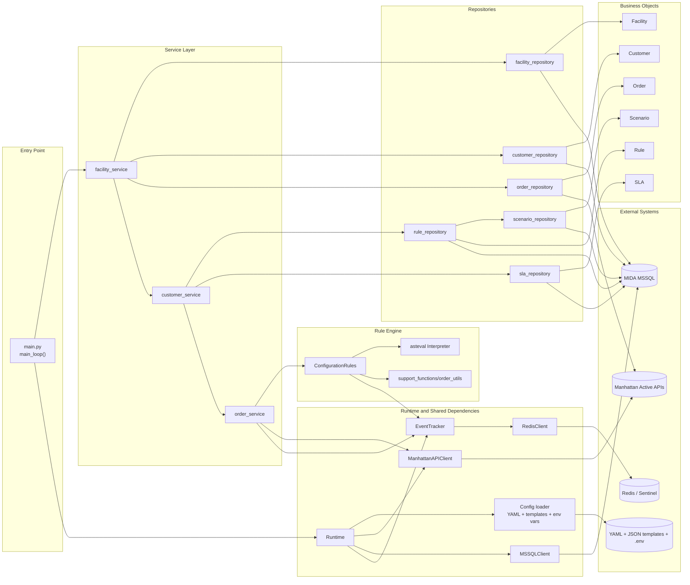

## 4. Startup and Configuration Loading

`Runtime.config()` lazily loads a validated `AppConfig` through `helpers.config_loader.Config`.

Configuration loading works as follows:

- load `.env`
- resolve `CONFIG_DIR` and `TEMPLATES_DIR`
- load `configurations/constants.yaml`
- load `configurations/regions_<region>_<env>.yaml`
- merge both dictionaries
- inject JSON templates such as `manhattan_templates/search.json`
- substitute `${ENV_VAR}` placeholders recursively
- validate the final structure with `AppConfig` from `helpers.config_schema`

If configuration files are missing or environment variables are unresolved, the process aborts immediately with `os.abort()`.

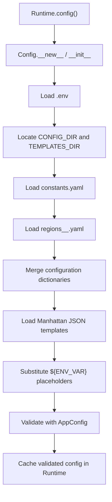

## 5. Execution Loop

`main.py` runs an infinite loop. Each cycle:

- computes the next scheduled run
- spawns a worker thread targeting `process_facilities()`
- waits up to `process.max_execution_seconds`
- logs a warning if the worker is still alive after the timeout
- sleeps until the next `process.interval_seconds` boundary

Important detail:

- the warning does not kill the worker thread
- a long-running thread may continue in the background after the main loop logs the timeout

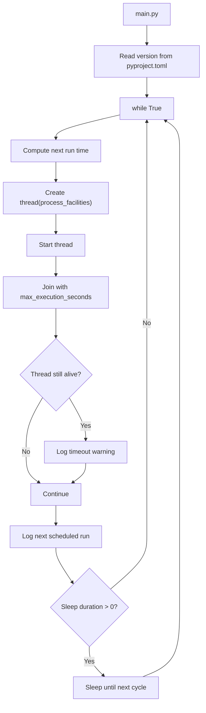

## 6. Runtime and Shared Clients

`Runtime` is the central dependency hub. It caches:

- `AppConfig`
- `ManhattanAPIClient`
- `MSSQLClient`
- `EventTracker`

Creation behavior:

- Manhattan client creation failure aborts the process
- MSSQL client creation failure aborts the process
- Event tracker creation failure is logged, but the process continues

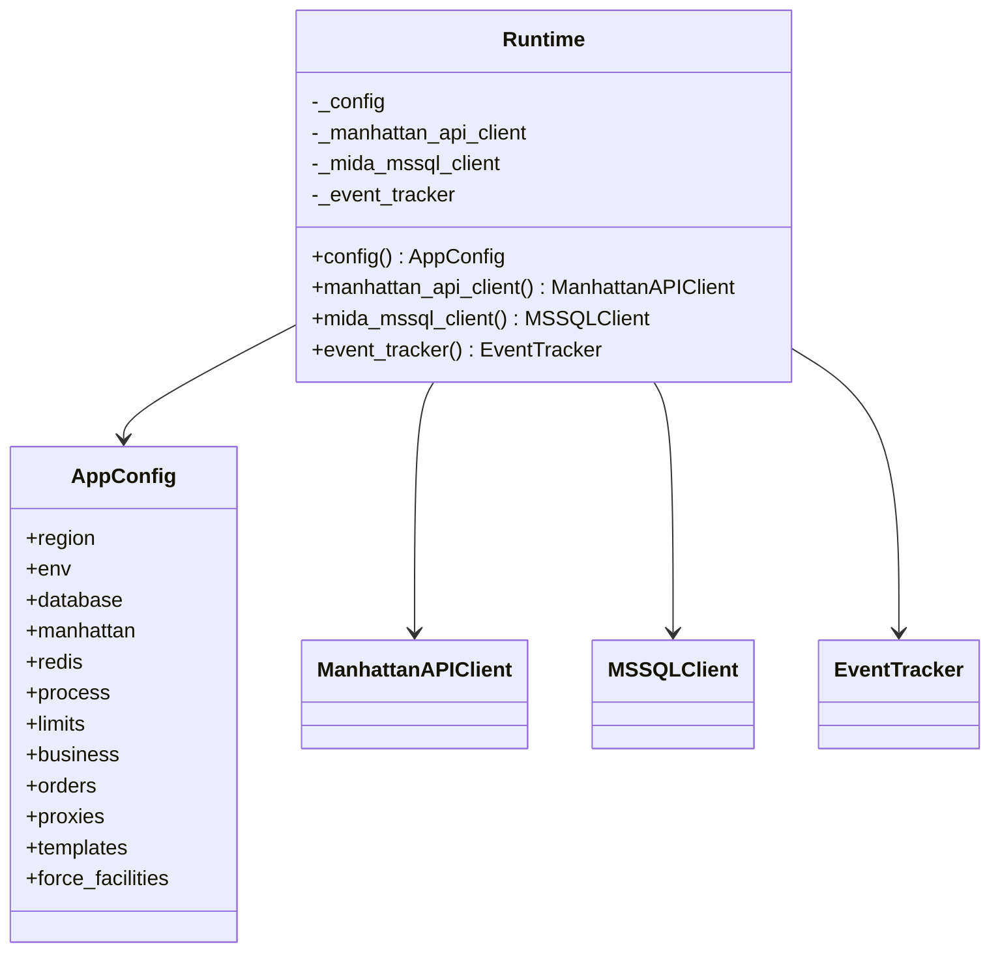

## 7. Facility-to-Order Processing Pipeline

The main orchestration path is:

1. enumerate target facilities
2. enumerate enabled customers per facility
3. stop early if too many orders are already in `PREPROCESSED`
4. search Manhattan for open orders
5. group orders by customer
6. load rules and SLA scenarios for each customer
7. evaluate each order
8. build Manhattan update payloads
9. bulk update orders
10. release successfully updated orders
11. persist audit logs and clear in-memory tracking buffers

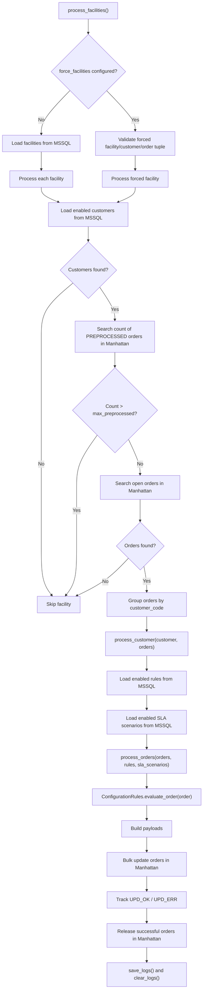

## 8. Forced-Processing Branch

For UAT and automated testing, `force_facilities` can override the standard discovery flow.

This branch:

- validates facility codes against MSSQL
- optionally validates explicit customers
- optionally fetches explicit order IDs from Manhattan
- logs security warnings
- still reuses the same downstream customer and order processing pipeline

This setting is explicitly marked in the code as unsafe for production use.

## 9. Repository and Data Access View

Repositories split responsibilities by source:

- **MSSQL-backed repositories**
  - `facility_repository`
  - `customer_repository`
  - `rule_repository`
  - `scenario_repository`
  - `sla_repository`
- **Manhattan-backed repository**
  - `order_repository`

`order_repository` builds Manhattan queries for:

- count of `PREPROCESSED` but unreleased orders
- retrieval of eligible open orders
- retrieval of one explicit order for forced execution

Important Manhattan search filters currently embedded in the repository:

- `MaximumStatus=0000`
- `Extended.DhlEventCode=null` for open orders
- `Extended.DhlEventCode='PREPROCESSED'` for backlog count
- `OrderProcessTypeId=null`
- exclusion of `PipelineId='Add iLPN to Order'`
- `CreatedTimestamp >= today - default_days_back`

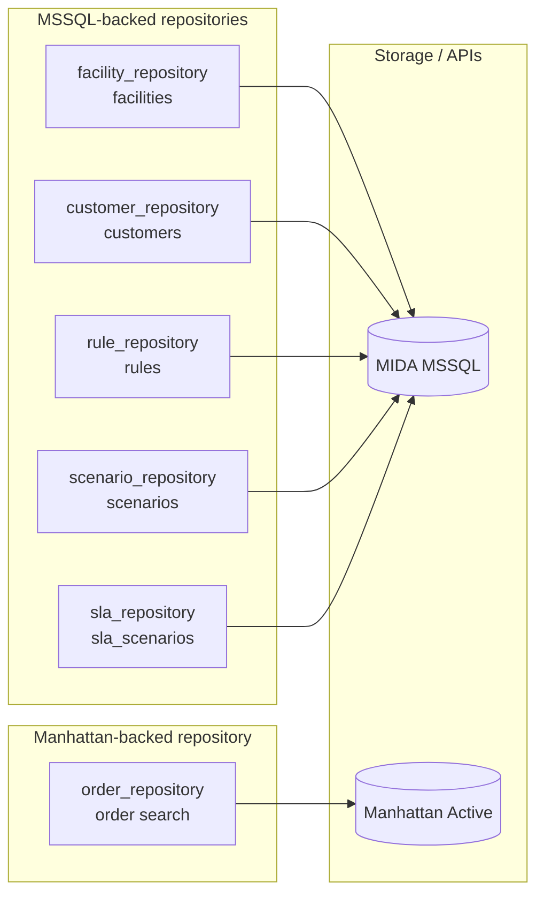

## 10. Rule Evaluation Engine

`ConfigurationRules` is the core business engine.

It evaluates:

- rule conditions
- scenario conditions under each matched rule
- SLA conditions after payload enrichment
- line-level modifications for `OrderLine`

Implementation characteristics:

- rules and scenarios are data-driven and loaded from MSSQL
- conditions are normalized with `condition_fix()`
- expressions are evaluated with `asteval.Interpreter`
- public functions from `support_functions/order_utils.py` are dynamically exposed to the interpreter
- evaluation context includes:
  - `o`: merged order header/body fields
  - `l`: current line when evaluating line-level modifications
  - Python built-ins: `any`, `all`, `len`, `min`, `max`

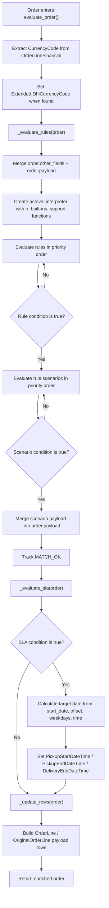

## 11. Rule, Scenario, and SLA Object Model

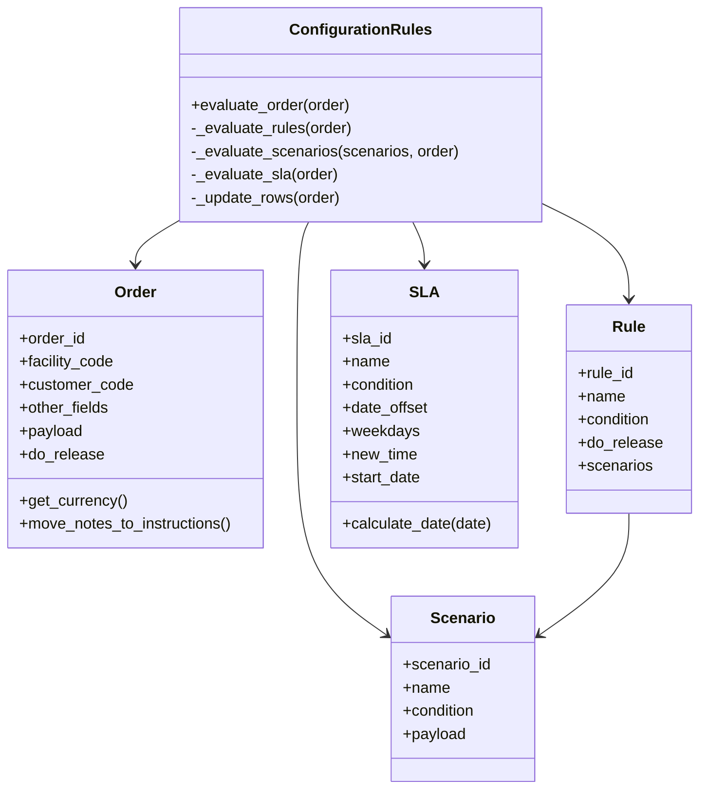

## 12. Payload Construction and Transformation

After a successful evaluation, `order_service` transforms orders into Manhattan payloads.

Key transformations currently implemented:

- move selected notes into order instructions
- rename mapped fields according to `config.orders.mapped_fields`
- force these identifiers into the payload:
  - `OriginFacilityId`
  - `BusinessUnitId`
  - `OriginalOrderId`
- force `Extended.DhlEventCode = PREPROCESSED`
- remove unnecessary line payload content if only identity fields are present
- recursively strip milliseconds from UTC timestamps

Line construction inside `_update_rows()` uses:

- `PK`
- `OriginalOrderLineId`
- synthetic `Unique_Identifier = "<PK>__<OriginalOrderLineId>"`
- optional `Priority`
- optional `OriginalOrderLineNotes`
- optional `OriginalOrderLineInstruction`

## 13. Order Update and Release Pipeline

Once payloads are built:

- payloads are chunked using `limits.orders_chunk_update`
- each chunk is sent to Manhattan `originalOrder/bulkImport`
- per-order success and error information is parsed from Manhattan messages
- successful order IDs are accumulated
- orders with `MaximumStatus >= 1000` are excluded from release during the migration period
- releasable IDs are chunked using `limits.orders_chunk_release`
- each chunk is sent asynchronously to Manhattan `order/criteria/evaluatePipelineAndPriority`

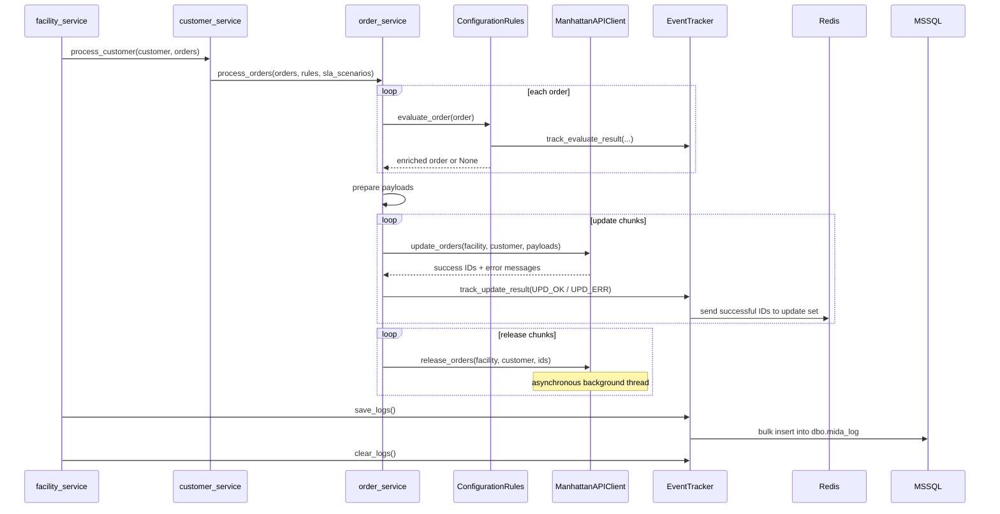

## 14. Manhattan API Adapter Behavior

`ManhattanAPIClient` owns authentication and all outbound HTTP POST calls.

Capabilities:

- password grant authentication on startup
- refresh-token renewal before expiry
- proxy support for HTTP and HTTPS
- order search
- bulk order update
- release pipeline triggering

Operational behavior:

- authentication failures abort the process
- request timeouts return `{success: False}`
- responses are parsed to extract business-key-based order errors
- customer authorization errors during search are handled by removing unauthorized customer codes and retrying
- release calls are fire-and-forget background threads

Endpoints currently used:

- `/oauth/token`
- `/dcorder/api/dcorder/order/search`
- `/dcorder/api/dcorder/originalOrder/bulkImport`
- `/dcorder/api/dcorder/order/criteria/evaluatePipelineAndPriority`

## 15. Tracking, Logging, and Operational Observability

`EventTracker` is the operational bridge between the processing pipeline and the monitoring/audit sinks.

It maintains an in-memory SQL buffer and flushes it at the end of each facility-processing cycle.

Tracked event types:

- `MATCH_OK`
- `MATCH_ERR`
- `UPD_OK`
- `UPD_ERR`
- `GENERIC`

Sinks:

- **MSSQL**
  - bulk insert into `dbo.mida_log`
  - `source` is hardcoded as `PREPROC`
- **Redis set**
  - successful updates are added to the configured update queue
  - downstream consumers can check release completion later
- **Redis hash**
  - API call payloads can be stored with retention

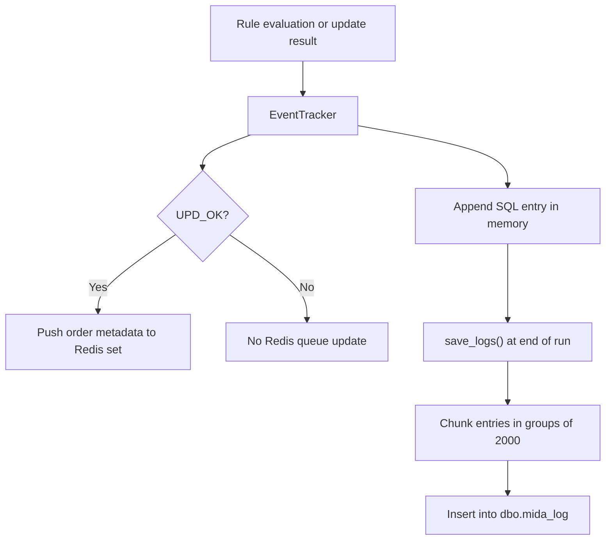

## 16. Deployment and Runtime Boundaries

The service is built as a containerized Python application.

Runtime boundaries visible in the repository:

- `Dockerfile`
- `entrypoint.sh`
- `.github/workflows/*`
- `configurations/`
- `manhattan_templates/`

Environment-specific behavior is driven by:

- `REGION`
- `ENV`
- `CONFIG_DIR`
- `TEMPLATES_DIR`
- secret values referenced through `${...}` placeholders

Regional files exist for:

- `apac`
- `emea`
- `latam`
- `noram`

Environment variants exist for:

- `dev`
- `test`
- `prod`

## 17. Operational Limits and Safeguards

Current safeguards from configuration and code include:

- polling interval control with `process.interval_seconds`
- soft execution threshold with `process.max_execution_seconds`
- skip facility when `PREPROCESSED` backlog exceeds `limits.max_preprocessed`
- max fetched orders per execution with `limits.max_orders_per_execution`
- API paging with `limits.api_fetch_page_size`
- update chunking with `limits.orders_chunk_update`
- release chunking with `limits.orders_chunk_release`
- explicit warnings when `force_facilities` is enabled

## 18. Architecture Boundaries

```mermaid
flowchart LR
    subgraph Core["Core Processing Logic"]
        SVC["services/*"]
        ENG["core/configuration_rules.py"]
        BO["business_objects/*"]
        SUP["support_functions/order_utils.py"]
    end

    subgraph Infrastructure["Infrastructure and Integration"]
        REP["core/repositories/*"]
        ADP["core/adapters/*"]
        TRK["core/tracking/*"]
        CFG["helpers/config_loader.py"]
    end

    subgraph External["External Platforms"]
        X1[("MIDA MSSQL")]
        X2[("Manhattan Active")]
        X3[("Redis")]
        X4[("Config files")]
    end

    Core --> Infrastructure
    Infrastructure --> External
```

## 19. Current Design Observations

The current design has a few notable characteristics that are useful to keep in mind when extending the system:

- `Runtime` acts as a global dependency container rather than explicit dependency injection
- service functions are procedural, not class-based
- repositories return rich domain objects but depend directly on `Runtime`
- the rule engine mutates `Order` objects in place
- release is asynchronous and not awaited
- tracking is buffered in memory and flushed only at the end of facility processing
- Manhattan search and update logic is tightly coupled to current business filters and payload conventions

## 20. Recommended Usage Notes

This document is most useful together with:

- `src/main.py`
- `src/runtime.py`
- `src/services/*.py`
- `src/core/configuration_rules.py`
- `src/core/adapters/manhattan_api_client.py`
- `src/core/tracking/event_tracker.py`

If the implementation changes, this document should be updated together with:

- configuration keys
- Manhattan endpoints
- repository query semantics
- Redis queue behavior
- rule-evaluation semantics

## 21. Rendering Notes

- GitHub and GitLab render Mermaid diagrams directly in Markdown
- VS Code can render Mermaid with the appropriate extension
- Confluence usually supports Mermaid only through an app or macro
- Jira does not natively render Mermaid in issue descriptions in most setups

