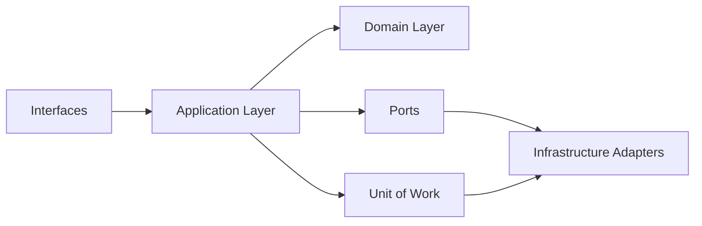

# Architecture Overview

This document explains the architectural ideas behind `rules-enrichment-daemon`
without focusing on deployment steps or operational commands.

## Intent

The service is designed as a small but teachable example of a layered Python
application that:

- polls business data from an external system
- applies domain rules
- persists processing state safely
- publishes follow-up events
- remains observable in constrained OpenShift environments

Even though the repository started as a PoC, its structure is intentionally
close to a reusable internal template.

## Layered Structure

### Domain

The domain layer contains the business concepts that should remain stable even
if the framework, database, or transport changes.

Typical contents:

- entities
- value objects
- domain services
- specifications

Examples in this repository:

- `ExternalOrder`
- `EnrichmentRule`
- `RuleEvaluationService`
- `PredicateSpecification`

### Application

The application layer coordinates work. It decides which steps happen and in
what order, but it should avoid embedding low-level framework details.

Typical contents:

- use cases
- DTOs
- commands
- builders
- mappers
- ports

Examples in this repository:

- `ProcessOrderForEnrichmentUseCase`
- `EnrichmentPayloadDTO`
- `ProcessOrderCommand`
- `EnrichmentPayloadBuilder`

### Infrastructure

The infrastructure layer implements the concrete details required by the
application:

- SQLAlchemy repositories
- HTTP clients
- outbox sinks
- schedulers and workers
- OpenShift-specific runtime behaviors

Examples in this repository:

- `SqlAlchemyEnrichmentRuleRepository`
- Manhattan simulator HTTP client
- `StructuredLogOutboxSink`
- polling worker

## Main Processing Flow

At a high level, one polling cycle looks like this:

1. a worker triggers the enrichment facade
2. the facade polls candidate orders from the external WMS
3. the application loads matching active rules
4. the domain evaluates those rules against each order
5. the application builds an enrichment payload
6. the application submits the enrichment
7. the Unit of Work persists attempts, processed state, and outbox messages
8. logs are emitted for observability

## Why Ports Matter

Ports are contracts owned by the application layer.

They let the application say:

- "I need to load rules"
- "I need to save a dead-letter item"
- "I need to submit enrichment to an external WMS"

without saying:

- "use SQLAlchemy"
- "call this HTTP client"
- "write this exact SQL statement"

That separation makes testing easier and keeps future migrations localized to
adapter code.

## Why Unit of Work Matters

The Unit of Work is the transaction boundary of the service.

It helps the application persist related changes as one business outcome, for
example:

- save a processing attempt
- update processed-order state
- enqueue an outbox event

If one of those steps fails, the whole unit can be rolled back.

## Why the Outbox Pattern Is Used

The service records business events in an outbox table before trying to publish
them externally.

This avoids a common failure mode:

- business state is saved
- external publication fails
- the system loses track of the event

With an outbox:

- business persistence happens first
- publication can be retried later from durable storage

## Idempotency Strategy

The daemon may see the same order more than once across polling cycles.

To avoid resubmitting equivalent enrichment repeatedly, the application stores
an enrichment hash for successfully processed orders.

If the same order would produce the same enrichment result again, the order can
be skipped safely.

## Logging Strategy

The repository supports two logging transport strategies:

- sidecar shipper
- native ClusterLogForwarder path

The application itself stays simple:

- produce structured logs
- write to stdout
- optionally write to a shared file for the temporary shipper path

This keeps observability concerns visible without pushing logging transport
logic deep into the domain or application layers.

## Guidance For New Services

If you reuse this template, a good rule of thumb is:

- put business meaning in `domain`
- put orchestration in `application`
- put technology-specific code in `infrastructure`

When in doubt, ask:

- does this code answer a business question?
- does this code coordinate a workflow?
- does this code depend on a framework, database, or remote API?

The answer usually tells you where the code belongs.
