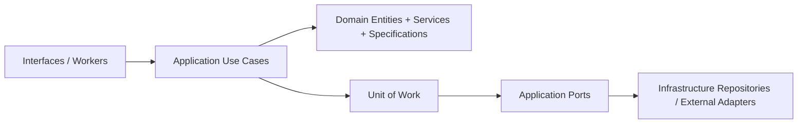

# rules-enrichment-daemon

`rules-enrichment-daemon` is a Python background service that polls orders from an external system, evaluates enrichment rules, submits the enrichment result, persists processing state, and emits structured logs for observability.

This repository is intentionally useful in two ways:

- as a PoC that demonstrates the enrichment workflow end to end
- as a reference implementation that other internal Python services can copy and adapt

If you want the conceptual view first, read:

- [ARCHITECTURE.md](/C:/Users/ebb901/repo/sandbox/rules-enrichment-daemon/ARCHITECTURE.md)

## What This Service Does

At a business level, the daemon:

1. polls orders in `READY_FOR_ENRICHMENT`
2. loads active rules from its own database
3. evaluates those rules against each order
4. builds an enrichment payload
5. submits enrichment back to the external API
6. persists processing attempts and outbox events
7. logs every cycle in ECS-friendly structured format

## Architectural Overview

The project follows a layered structure:

- `interfaces`
  - CLI entrypoints and the health API
- `application`
  - use cases and the orchestration facade
- `domain`
  - entities, value objects, domain services, specifications
- `infrastructure`
  - database, HTTP clients, repositories, workers, log shipping
- `shared`
  - logging, IDs, clock, result/error helpers

The practical flow of one daemon cycle is:

1. the polling worker calls the enrichment facade
2. the facade polls candidate orders from the external API
3. the facade refreshes rule cache and loads matching rules
4. each order is processed independently
5. results are persisted through a Unit of Work
6. outbox messages are emitted
7. structured logs are produced for Elasticsearch/Kibana

### Short architectural map



## How To Read This Codebase

If you are new to Python or to this architectural style, a good reading order is:

1. `domain/entities`
   - business data structures such as orders, rules, and processing artifacts
2. `domain/services` and `domain/specifications`
   - pure business logic and rule evaluation
3. `application/use_cases`
   - orchestration of one business action at a time
4. `application/ports`, `application/dto`, `application/mappers`, `application/builders`, and `application/commands`
   - contracts, transport shapes, translation boundaries, and application inputs
5. `infrastructure/repositories/sqlalchemy`
   - translation between domain entities and database models
6. `tests`
   - executable examples that show how the pieces collaborate

### Ports, DTOs, and mappers

These three folders are easy to confuse at first, so it helps to keep a simple
mental model:

- ports
  - abstract contracts that define what the application needs from the outside world
- DTOs
  - small data-carrier objects used at the application boundary
- mappers
  - explicit translators between internal objects and external payload shapes

Together, they keep the use cases independent from framework details and make
future adapter changes less invasive.

### Builders, commands, and queries

Three other application-layer artifact types appear in this repository:

- builders
  - assemble DTOs or payload shapes from richer domain or application objects
- commands
  - represent the input intent for one application action
- queries
  - would represent read-only lookup models when the application grows more complex

In this PoC, `queries` is still intentionally small, but the folder exists to
show where read-oriented application models can live without mixing them with
commands or domain entities.

### Domain layer

The domain layer is the part that should stay the most stable across frameworks,
databases, and deployment environments.

In this repository it contains:

- entities
  - plain dataclasses such as `ExternalOrder` and `EnrichmentRule`
- value objects
  - small immutable structures such as addresses
- domain services
  - reusable business logic such as rule evaluation and enrichment hashing
- specifications
  - composable predicates that turn rule JSON into executable conditions

The main idea is that the domain should answer business questions without
depending on FastAPI, SQLAlchemy, OpenShift, or Elasticsearch.

### Use cases

Use cases live in `application/use_cases` and represent one application action,
for example:

- evaluate rules
- process one order
- persist a processing result
- publish pending outbox messages

These classes are intentionally small. Their job is to coordinate collaborators,
not to own every implementation detail. This keeps the system easier to test,
refactor, and explain.

### SQLAlchemy repositories

The repositories in `infrastructure/repositories/sqlalchemy` are adapter code.
They translate between:

- domain entities used by the application
- SQLAlchemy models used by the database layer

That separation is useful because it prevents ORM details from spreading through
the rest of the codebase.

### Tests as executable documentation

The test suite is not only there to catch regressions. It is also intended to
show future teams how the building blocks are supposed to be used.

A helpful reading order is:

- `tests/unit/test_rule_engine.py`
  - what a rule match looks like from a business perspective
- `tests/unit/test_payload_builder.py`
  - what the enrichment payload should contain
- `tests/contract/test_payload_contract.py`
  - which JSON keys form the external contract
- `tests/integration/test_repositories.py`
  - how Bootstrap, UnitOfWork, and repositories fit together end to end

## Quick Onboarding Table

| Artifact type | Responsibility | Examples |
| --- | --- | --- |
| Domain entity | Represent core business data and behavior | `ExternalOrder`, `EnrichmentRule` |
| Domain service | Execute reusable business logic | `RuleEvaluationService` |
| Specification | Express composable rule predicates | `PredicateSpecification`, `AndSpecification` |
| Use case | Orchestrate one application action | `ProcessOrderForEnrichmentUseCase` |
| Port | Define what the application expects from external systems | `ExternalWmsPort`, `UnitOfWork` |
| DTO | Carry application-boundary data | `EnrichmentPayloadDTO`, `PollResultDTO` |
| Mapper | Translate between internal and external shapes | `payload_to_dict` |
| Builder | Assemble a DTO or payload from richer objects | `EnrichmentPayloadBuilder` |
| Command | Package the input intent for an action | `PollOrdersCommand`, `ProcessOrderCommand` |
| Repository adapter | Implement a port using concrete infrastructure | `SqlAlchemyEnrichmentRuleRepository` |
| Test | Document expected behavior in executable form | `test_rule_engine.py`, `test_repositories.py` |

## How To Extend This Template For A New Service

If you want to reuse this repository as a starting point for a new internal
service, a practical sequence is:

1. define the new domain first
   - create entities, value objects, and domain services that describe the business problem
2. model the application flow with use cases
   - keep orchestration in `application/use_cases` and keep business rules in `domain`
3. define ports before adapters
   - describe what the application needs from databases, HTTP APIs, or messaging systems
4. implement infrastructure adapters last
   - repositories, HTTP clients, schedulers, and deployment-specific concerns
5. add tests as executable examples
   - one unit test for core business rules, one integration test for persistence, and one contract test for external payloads
6. document operational choices
   - logging mode, retry strategy, idempotency approach, and deployment assumptions

As a rule of thumb:

- if a class answers a business question, it probably belongs in `domain`
- if a class coordinates a workflow, it probably belongs in `application`
- if a class talks to a framework, database, or external API, it probably belongs in `infrastructure`

## Repository Layout

```text
rules-enrichment-daemon/
  README.md
  Dockerfile
  docker-compose.yml
  pyproject.toml
  migrations/
  tests/
  openshift/
    dev/
    test/
    deploy-rules-enrichment-daemon-dfn.ps1
  src/app/
    application/
    config/
    domain/
    infrastructure/
    interfaces/
    shared/
```

## Important Runtime Concepts

### 1. One application image, multiple containers in one pod

In OpenShift, this project is deployed as one `Deployment`, but the resulting pod contains multiple containers:

1. `daemon`
   - runs the business loop
2. `log-shipper`
   - optional sidecar that tails a shared log file and forwards logs to Elasticsearch
3. `health`
   - exposes `/live`, `/ready`, and `/health`

This is possible because Kubernetes pods are designed to host multiple cooperating containers that share:

- the same pod network
- optional shared volumes

This pattern is called a `sidecar` pattern.

### 2. Shared file-based log shipping

When the temporary shipper mode is enabled:

1. the `daemon` writes logs to `stdout`
2. the `daemon` also writes the same logs to a shared file
3. that file lives in an `emptyDir` volume mounted into both `daemon` and `log-shipper`
4. the `log-shipper` sidecar tails the file and sends new lines to Elasticsearch using `_bulk`

### 3. Incremental reading by byte offset

The shipper does not reread the entire file on every loop.
It keeps an in-memory byte offset and:

1. seeks to the last known offset
2. reads only the appended lines
3. stores the new offset

If the file is truncated or recreated, the shipper detects that the current file size is smaller than the stored offset and restarts from the beginning of the new file.

### 4. SQLite vs Postgres

The project supports both storage modes:

- Postgres for richer local development
- SQLite for restricted OpenShift deployments where adding another service would be too expensive or blocked

The code chooses the effective database URL through `Settings.effective_database_url` so the rest of the application does not need environment-specific branching.

## Local Development

### Install dependencies

```bash
pip install -e .[dev]
```

### Run migrations

```bash
alembic upgrade head
```

### Seed baseline rules

```bash
seed-rules
```

### Run the daemon

```bash
run-daemon
```

### Run the health API

```bash
uvicorn app.interfaces.health.api:app --host 0.0.0.0 --port 8080
```

## Docker Compose

A local Compose file is included for quick testing with Postgres:

```bash
docker compose up --build
```

This mode is intentionally simpler than OpenShift:

- one container runs the daemon
- one Postgres container stores data
- no sidecar is used here

## CLI Commands

Main commands exposed by the CLI:

- `run-daemon`
- `publish-outbox`
- `seed-rules`
- `replay-dead-letter`
- `health-check`
- `validate-rules`
- `forward-log-file`

### What `forward-log-file` does

This command is used by the sidecar container in OpenShift.
It:

1. opens the shared log file
2. resumes from the last byte offset
3. parses JSON or falls back to plain text
4. builds Elasticsearch `_bulk` payloads
5. sends batches to Elasticsearch
6. loops forever

## Configuration

The configuration is environment-driven and typed through `pydantic-settings`.

Important settings include:

- `APP_NAME`
- `APP_ENV`
- `APP_VERSION`
- `EXTERNAL_API_BASE_URL`
- `EXTERNAL_API_TIMEOUT_SECONDS`
- `POLL_INTERVAL_SECONDS`
- `POLL_BATCH_SIZE`
- `RULE_CACHE_TTL_SECONDS`
- `MAX_PROCESSING_ATTEMPTS`
- `OUTBOX_SINK_MODE`
- `USE_SQLITE`
- `DATABASE_URL`
- `SQLITE_DATABASE_URL`

### Logging settings

- `LOG_LEVEL`
- `LOG_ECS_ENABLED`
- `LOG_TO_STDOUT`
- `LOG_TO_FILE`
- `LOG_FILE_PATH`

### Shipper settings

- `LOG_SHIPPER_ENABLED`
- `LOG_SHIPPER_ELASTICSEARCH_URL`
- `LOG_SHIPPER_ELASTICSEARCH_USERNAME`
- `LOG_SHIPPER_ELASTICSEARCH_PASSWORD`
- `LOG_SHIPPER_INDEX_PREFIX`
- `LOG_SHIPPER_FLUSH_INTERVAL_SECONDS`

## OpenShift Deployment

Main DFN deployment script:

- [deploy-rules-enrichment-daemon-dfn.ps1](/C:/Users/ebb901/repo/sandbox/rules-enrichment-daemon/openshift/deploy-rules-enrichment-daemon-dfn.ps1)

### Deploy to test

Run from `C:\Users\ebb901\repo\sandbox\rules-enrichment-daemon\openshift`.

```powershell
.\deploy-rules-enrichment-daemon-dfn.ps1 -Environment test -Namespace dsc-dhl-fulfillment-network-mida -BuildSource Binary
```

### Deploy to prod

```powershell
.\deploy-rules-enrichment-daemon-dfn.ps1 -Environment prod -Namespace dsc-dhl-fulfillment-network-mida -BuildSource Binary
```

### Deploy from Git instead of binary upload

```powershell
.\deploy-rules-enrichment-daemon-dfn.ps1 -Environment test -Namespace dsc-dhl-fulfillment-network-mida -BuildSource Git -GitUri https://git.example/repo.git -GitRef main -GitSecretName <SECRET_NAME>
```

## Log Transport Modes

The deployment script supports three transport modes:

- `shipper`
- `clusterlogforwarder`
- `both`

### Shipper mode

```powershell
.\deploy-rules-enrichment-daemon-dfn.ps1 -Environment test -Namespace dsc-dhl-fulfillment-network-mida -BuildSource Binary -LogTransportMode shipper
```

Behavior:

- daemon logs to `stdout`
- daemon logs to shared file
- sidecar shipper reads file and sends to Elasticsearch

### ClusterLogForwarder mode

```powershell
.\deploy-rules-enrichment-daemon-dfn.ps1 -Environment test -Namespace dsc-dhl-fulfillment-network-mida -BuildSource Binary -LogTransportMode clusterlogforwarder
```

Behavior:

- daemon logs to `stdout`
- daemon does not write the shared file
- sidecar remains idle
- intended for native OpenShift collector + CLF path

### Both mode

```powershell
.\deploy-rules-enrichment-daemon-dfn.ps1 -Environment test -Namespace dsc-dhl-fulfillment-network-mida -BuildSource Binary -LogTransportMode both
```

Behavior:

- keeps both paths active during migration or troubleshooting

## Start, Stop, Restart in OpenShift

### Restart

```powershell
oc -n dsc-dhl-fulfillment-network-mida rollout restart deployment/rules-enrichment-daemon-dfn-d-test
oc -n dsc-dhl-fulfillment-network-mida rollout status deployment/rules-enrichment-daemon-dfn-d-test --timeout=600s
```

### Stop

```powershell
oc -n dsc-dhl-fulfillment-network-mida scale deployment/rules-enrichment-daemon-dfn-d-test --replicas=0
```

### Start again

```powershell
oc -n dsc-dhl-fulfillment-network-mida scale deployment/rules-enrichment-daemon-dfn-d-test --replicas=1
```

### OpenShift UI path

- `Administrator > Workloads > Deployments`
- open `rules-enrichment-daemon-dfn-d-test`
- use `Scale`

## Kibana / Elasticsearch Usage

When the sidecar shipper is active, the daemon writes to indices such as:

- `rules-enrichment-daemon-logs-YYYY.MM.DD`

Recommended Kibana Data View:

- Name: `Rules daemon logs`
- Index pattern: `rules-enrichment-daemon-logs-*`
- Timestamp field: `@timestamp`

## Troubleshooting

### I changed `LOG_TO_FILE` in one place and shipping still does not work

Remember that the pod has multiple containers, and each container has its own environment block.

The important settings for reactivating the shipper are:

- in the daemon: `LOG_TO_FILE=true`
- in config: `LOG_SHIPPER_ENABLED=true`

The `LOG_TO_FILE` variable inside the `log-shipper` container only controls the shipper's own logs, not the daemon's business log file.

### Why is the same env var repeated in the YAML?

Because those values belong to different containers:

- `daemon`
- `log-shipper`
- `health`

That is expected in Kubernetes and does not mean the YAML is invalid.

### The daemon runs but no logs appear in Kibana

Check:

1. which transport mode is active
2. whether the shipper is enabled or idle
3. which Data View you are using
4. whether you are looking at shipper indices or CLF/collector indices

## Why this repo matters as a template

This repository is intentionally more than a throwaway PoC.
It demonstrates:

- a layered Python service architecture
- typed environment-driven configuration
- transaction handling with Unit of Work
- resilient daemon loops
- structured logging with ECS
- a temporary sidecar shipping pattern for restricted OpenShift clusters
- a migration path toward native ClusterLogForwarder-based logging
